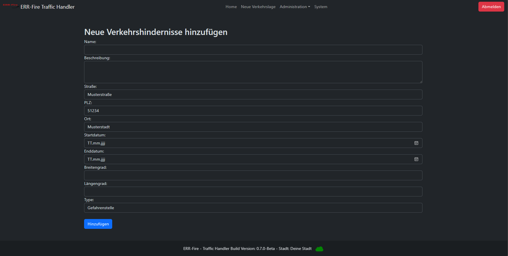

# Erste Schritte

## Login 

Beim Aufrufen des TrafficHandler, landet man auf der Login-Seite.

Mit folgenden Standard-Benutzerdaten kann man sich nun anmelden.

`Benutzername: poweruser`  
`Passwort: powerAdmin`

⚠️ Der Administrator wird aufgefordert, unmittelbar nach dem Einloggen das Passwort zu erneuern.

  
## Standard Ansicht

Nach der erfolgreichen Anmeldung, laden Sie auf der Startseite.

Diese besteht aus dem Menüband, wo Sie in die einzelnen Seiten wechseln können, darüberhianus können Sie
den aktuellen User sehen, mit dem Sie angemeldet sind als auch der zugewiesenen Rolle.

  
Auf der Startseite wird darüberhinaus eine _OpenStreetMap Karte_ angezeigt, die innerhalb den aktuellen
Standort inform eines Markes aufzeigt. Aktive Verkehrslagen, werden mit einem roten Warnsymbol angezeigt.
Beim Anklicken der Objekte erhält man weitere Informationen diesbezüglich.

Unter dem Punkt _Aktive Verkehrslage_ sind alle eingetragene Verkehrslagen hinterlegt.
Dabei werden folgende Informationen dargestellt.

- Titel
- Adresse
- Startdatum
- Enddatum
- Beschreibung
- Koordinaten

  
## Neue Verkehrslage hinzufügen

Innerhalb dieser Seite haben Sie die Möglichkeit neue Verkehrslagen einzutragen. Aktuell ist dies
nur über die Webseite möglich.
Perspektivisch soll auch über bereitgestellte Schnittstelle auch Fremdsysteme angebunden werden können.
  
Es handelt sich bei allen Feldern um Pflichtfelder.

Für die Koordinaten eingabe, zur Darstellung auf der Karte, hat sich folgende Seite als praktikabel geeignet.
  
(https://www.gpskoordinaten.de/)

  

  

## Verkehrslage Löschen

Verkehrslagen löschen sich nach Ablauf des Enddatum nicht selbständig. Dies ist als Feature in einer höheren Version vorgesehen.

Dies kann über diese Seite realisiert werden. Das geht entsprechend nur mit benutzern welche 
die Berechtigungsgruppe (Admin oder Editor) zugewiesen haben.

  

## Benutzerverwaltung

Innerhalb der Anwendungen können weitere User erstellt bzw. gelöscht werden, Passwörter geändert als auch Benutzergruppen angepasst werden.
Die Benutzerverwaltung ist dabei den User(n) mit der Rolle _Admin_ vorbehalten.

Anbei finden Sie eine Übersicht über die Rollenberechtigung.

⚠️ Gehen Sie sorgfältig mit der Rollenvergabe um.

  

| **Rolle/ Möglichkeiten**      | **Admin** | **Editor** | **Viewer** |
|:------------------------------|:-----:|:------:|:------:|
| Zugang zum System             |   x   |   x    |   x    |
| Erstellen neuer Verkehrslagen |   x   |   x    |   o    |
| Verkehrslagen löschen         |   x   |   x    |   o    |
| Übersicht Benutzer            |   x   |   o    |   o    |
| Anpassung Benutzer            |   x   |   o    |   o    |
| Systemdaten                   |   x   |   o    |   o    |
| Alarmsystem                   |   x   |   o    |   o    |

  

